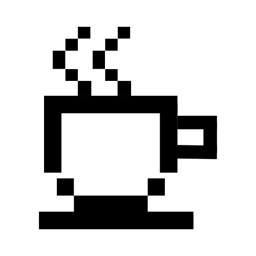

# Caffeine Meditations

Hello there,

Welcome to my small corner of the web. 

I’m someone who finds joy in the intersection of technology and thought. This is the space where I pause to reflect, explore, and occasionally ramble about the things that keep me up at night (and the caffeine that helps me enjoy it).

Expect musings on systems architecture and the occasional philosophical detour. Whether you're here for insights, inspiration, or just a good read with your morning brew—I'm glad you stopped by. -[gcartier](about)
